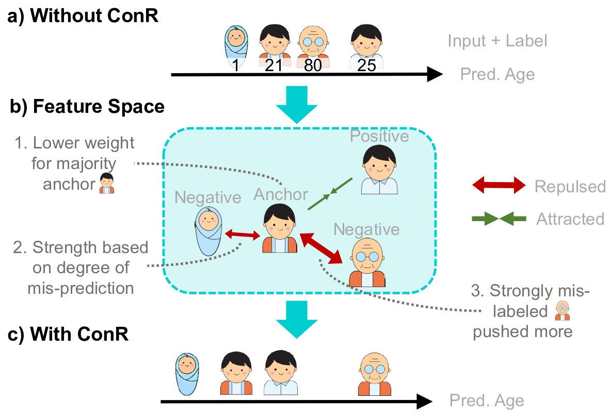

# ConR: Contrastive Regularizer for Deep Imbalanced Regression


<p align="center">
     <br>
Key insights of <b>ConR </b>. a) Without
ConR, it is common to have minority examples
mixed with majority examples. b) ConR selects
the sample with confusion around it as an anchor
and adjusts the feature space with relative con-
trastive learning. c) Reduced prediction error.
</p>

## Quick Preview
mbalanced distributions are ubiquitous in real-world data. They create constraints on Deep Neural Networks to represent the minority labels and avoid bias towards majority labels. The extensive body of imbalanced approaches address categorical
label spaces, but fail to effectively extend to regression problems where the label space is continuous. Conversely, local and global correlations among continuous labels provide valuable insights towards effectively modelling relationships in feature space. In this work, we propose <b>ConR </b>, a contrastive regularizer that models global and local label similarities in feature space and prevents the features of minority samples from being collapsed into their majority neighbours. Serving the similarities of the predictions as an indicator of feature similarities, <b>ConR </b> discerns the dissagreements between the label space and feature space, and imposes a penalty on these disagreements. <b>ConR </b> minds the continuous nature of label space with two main strategies in a contrastive manner: incorrect proximities are
penalized proportionate to the label similarities and the correct ones are encouraged to model local similarities. <b>ConR </b> consolidate essential considerations into a generic, easy-to-integrate, and efficient method that effectively addresses deep imbalanced regression. Moreover, <b>ConR </b> is orthogonal to existing approaches and smoothly extends to uni- and multi-dimensional label spaces. Our comprehensive experiments show that <b>ConR </b> significantly boosts the performance of all the state-of-the-art methods on four large-scale deep imbalanced regression benchmarks.

The following code snippent shows the implementation of ConR for the task of Age estimation

```python
def ConR(features, targets, preds, w=1, weights=1, t=0.07, e=0.01):
    q = torch.nn.functional.normalize(features, dim=1)
    k = torch.nn.functional.normalize(features, dim=1)

    l_k = targets.flatten()[None, :]
    l_q = targets

    p_k = preds.flatten()[None, :]
    p_q = preds

    l_dist = torch.abs(l_q - l_k)
    p_dist = torch.abs(p_q - p_k)

    pos_i = l_dist.le(w)
    neg_i = ((~ (l_dist.le(w))) * (p_dist.le(w)))

    for i in range(pos_i.shape[0]):
        pos_i[i][i] = 0

    prod = torch.einsum("nc,kc->nk", [q, k]) / t
    pos = prod * pos_i
    neg = prod * neg_i

    pushing_w = weights * torch.exp(l_dist * e)
    neg_exp_dot = (pushing_w * (torch.exp(neg)) * neg_i).sum(1)

    # For each query sample, if there is no negative pair, zero-out the loss.
    no_neg_flag = (neg_i).sum(1).bool()

    # Loss = sum over all samples in the batch (sum over (positive dot product/(negative dot product+positive dot product)))
    denom = pos_i.sum(1)

    loss = ((-torch.log(
        torch.div(torch.exp(pos), (torch.exp(pos).sum(1) + neg_exp_dot).unsqueeze(-1))) * (
                 pos_i)).sum(1) / denom)

    loss = (weights * (loss * no_neg_flag).unsqueeze(-1)).mean()

    return loss
```

## Usage

Please go into the sub-folder to run experiments for different datasets. 

- [IMDB-WIKI-DIR](./imdb-wiki-dir)
- [AgeDB-DIR](./agedb-dir)
- [NYUD2-DIR](./nyud2-dir)


## Acknowledgment

The code is based on [Yang et al., Delving into Deep Imbalanced Regression, ICML 2021](https://github.com/YyzHarry/imbalanced-regression/tree/main/imdb-wiki-dir) and [Ren et al.,Balanced MSE for Imbalanced Visual Regression, CVPR 2022](https://github.com/jiawei-ren/BalancedMSE). 
